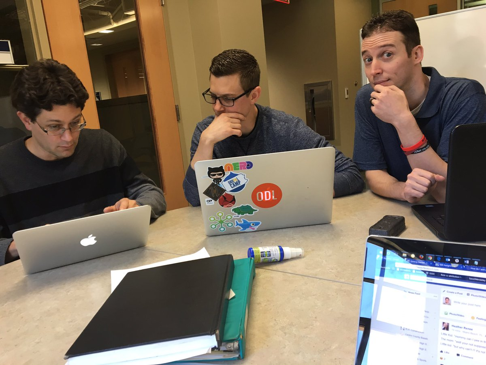
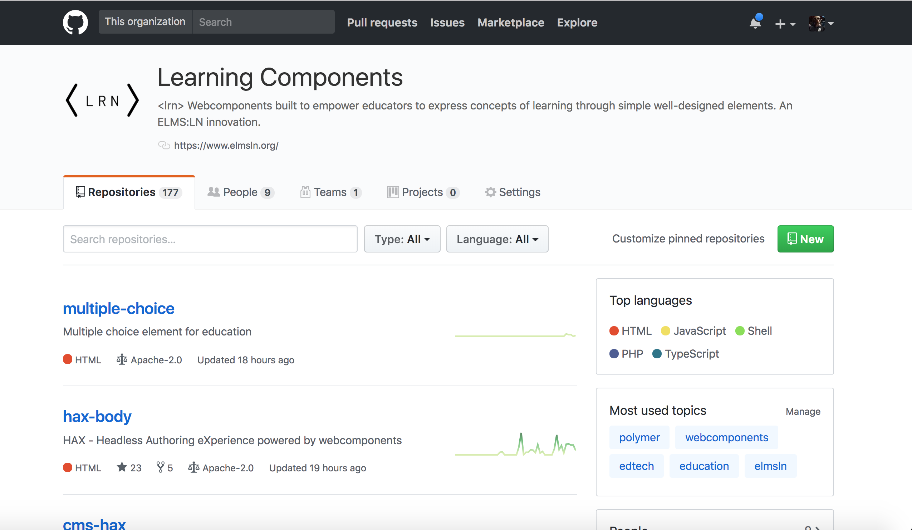
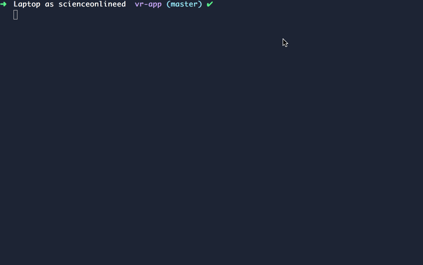
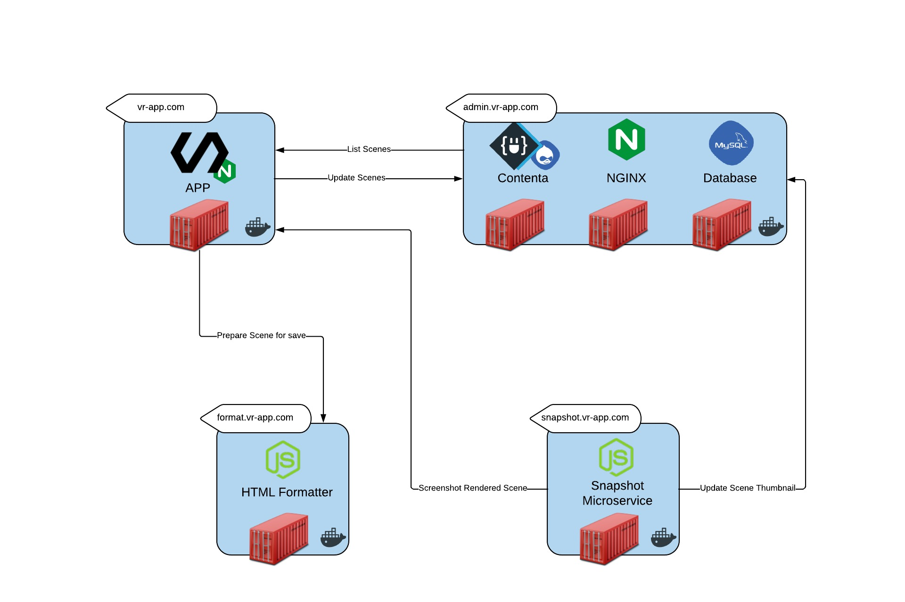
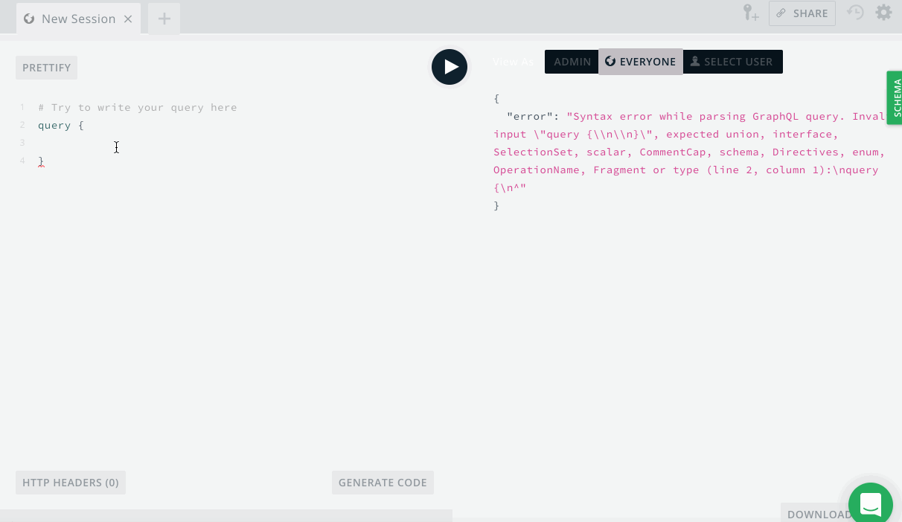

<!-- .slide: data-background="media/img/odlscience.png" -->
<div class="talk-title">
  <h1>Virtual Reality on the Web with A-Frame <br>
  and a Few of Its Friends</h1>
  <p class="talk-info">
    Office of Digital Learning | Eberly College of Science | Penn State University
  </p>
  <p class="talk-info tiny">
    This presentation is a fork of @aframevr's </br>
    [aframe-presentation-kit repo](https://github.com/aframevr/aframe-presentation-kit)
  </p>
</div>

<!-- NOTES -->
- Onboard web developers into the 3D and VR world with easy-to-use tools
- Prototype WebVR experiences faster

------

# Who we are
<!-- .slide: data-background="media/img/odlscience.png" -->
<div class="who_we_are_img">
  
</div>

---

# What we do
<!-- .slide: data-background="media/img/odlscience.png" -->
<div id="what_we_do_wrap">
  <div class="what_we_do_img">
    
  </div>
  <div class="what_we_do_text">
    The Office of Digital Learning (ODL) helps the Eberly College of Science faculty and students make the most of digital learning technology. We collaboratively design and build tools for any pedagogy.  Our emphasis is on accessibility, personalization, high quality content and instruction, and a consistent and stable learning infrastructure. 
  </div>
</div>

<!-- NOTES -->
- We strive to help faculty and students make the most of the digital learning technology available to them.
- We collaborateively design and build learning tools for any pedgogy.
- and we emphasize accessiblity, personalization, quality content and instruction, and consistent / stable learning infrastructure.

---

# Projects
<!-- .slide: data-background="media/img/odlscience.png" -->
<div id="project-wrap">
  <div class="project-image">
    
  </div>
  <div class="project-image">
    
  </div>
  <div class="project-image">
    
  </div>
  <div class="project-image">
    
  </div>
  <div class="project-image">
    
  </div>
  <div class="project-image">
    
  </div>
</div>

<!-- NOTES --> 

- ELMS:LN - Primary initiative - Opensource platform that allows us to manage and deploy custom learning tools. The project is set to receive recogniztion from Apereo as a fully active project. (Nonprofit organiztion that helps cultivate opensource projects for education).
- Learning Analytics (xAPI) - When we create / deploy these custom learning tools, we can start wiring in xAPI functionality to capture valuable data about the content being interacted with.
- OER Schema - Allows us to bake in custom meta data like (ids,for example) to help manage, oranize, share our educational content.
- Multimedia - Videos (OBS), annimations, graphics (SVG), etc.
- HAX - Secondary initative of ELMS:LN team - stands for "Headless Authoring Experience" - Future WYSIWYG editor that can be applied to any platform (browser based) and handles accessiblity / OER Schema automatically. haxtheweb.org
- Virtual Reality - and recently we started exploring VR / AR possiblities.    

---

# Faculty Story
<!-- .slide: data-background="media/img/odlscience.png" -->
<div id="faculty_story_wrap">
  <div class="faculty_story_img">
    
  </div>
  <div class="faculty_story_text">
     Katie Mantz (Course / Curriculum Developer - Forensic Science) and her team were looking to create an immersive crime scene experience for learners taking the FRNSC course. We met up and started strategizing goals and criteria for the project and decided to give Virtual Reality(VR) a shot.
  </div>
</div>
<!-- NOTES --> 
- We were new to VR so we had zero prior experience.
- Initially, we started looking into development in Unity but discovered a significant barrier to entry.
- Continued researching alternative solutions according to our criteria...  

---

# Criteria for Selecting Tech
<!-- .slide: data-background="media/img/odlscience.png" -->
<div id="criteria_wrap">
  <div class="criteria_img">
    
  </div>
  <div class="criteria_text">
    Viable <br>
    Accessible <br>
    Fiscally Responsible <br>
    Sustainable <br>
  </div>
</div>

<!-- NOTES -->
- Viable -  Goals of the project are accomplishable with on-hand or acquirable resources.
- Accessibility is a university mandate as well as an ethical and moral imperative as we are stewarding the relationship between online learners and their interactions with our products.
- Fiscal Responsibile specifically balances decisions oriented towards time spent building solutions vs. purchasing existing products.
- Sustainability for web based technology is difficult given the ever changing landscape, however, we project long-term viability based on emergent technology trends of which we spend a great deal of time researching.

------


<!-- .slide: data-background="media/img/aframe_homepage.png" -->

------

# Virtual Reality

<!-- .slide: data-background-video="media/video/virtualreality.mp4" data-background-video-loop="true" data-background-video-muted="true" data-state="state--bg-dark" -->

<!-- NOTES -->
- Ask how many have tried VR.
- Virtual reality is a technology platform that transports you to realistic, interactive, immersive 3D environments
- It's the next platform, will change how we work + play + communicate digitally, face of society

---

<div class="image-row">
  <div></div>
  <div></div>
  <div></div>
</div>

<div class="image-row">
  <div></div>
  <div></div>
  <div></div>
</div>

<!-- NOTES -->
- Backed by the largest corporations in the world, everyone wants in
- Range from cheap to expensive, tethered and untethered, controllers, tracking
- HTC Vive with Steam currently offers the most compelling experiences, but never know
- See a lot of different devices, systems, platforms competing against each other...

---

## Friction of VR Ecosystems

<div class="captioned-image-row">
  <div>
    
    <i>Gatekeepers</i>
  </div>
  <div>
    
    <i>Installs</i>
  </div>
  <div>
    
    <i>Closed</i>
  </div>
</div>

<!-- NOTES -->
- App stores and corporations control distribution: can take down or block content
- Downloads / installs are a barrier to consumption: small business pages
- Closed ecosystem: proprietary engines, steep learning curves, siloed experiences, fragmentation
- We want VR to be successful, so we want a platform without these points of friction. The answer is WebVR...

------

# WebVR

An open virtual reality platform with the advantages of **the Web**

<div class="captioned-image-row">
  <div>
    
    <i>Open</i>
  </div>
  <div>
    
    <i>Connected</i>
  </div>
  <div>
    
    <i>Instant</i>
  </div>
</div>

<!-- NOTES -->
WebVR is...virtual reality in the browser, powered by the Internet

Open:
- Anyone can publish
- Open source culture with open standards

Connected:
- Traverse worlds

Instant:
- Click a link on Twitter or Weibo, immediate VR experiences
- No installs
- Imagine for long tail experiences: shopping & personal spaces
- Great for long tail bite-sized experiences

Transition:
- Web has advantages that make it the best platform for the people
- Need to act to make it reality, can't wait for VR to bake and crystallize
- Get involved

---


Browser APIs that enable WebGL rendering to headsets and access to VR
sensors

https://w3c.github.io/webvr/

<!-- NOTES -->
API:
- Optimized rendering path to headsets
- Access position and rotation (pose) data

History:
- Initial WebVR API by Mozilla
- Working W3C community group
- Mozilla, Google, Samsung, Microsoft, community currently iterating WebVR 1.0 API

Not just a specification, it's implemented...

---

https://webvr.rocks

<div class="captioned-image-row small">
  <div>
    
    <i>Firefox Nightly</i>
  </div>
  <div>
    
    <i>Microsoft Edge</i>
  </div>
  <div>
    
    <i>Chromium</i>
  </div>
</div>

<div class="captioned-image-row small">
  <div>
    
    <i>Chrome for Android</i>
  </div>
  <div>
    
    <i>Oculus Carmel</i>
  </div>
  <div>
    
    <i>Samsung Internet</i>
  </div>
  <div>
    
    <i>Mobile Polyfill</i>
  </div>
</div>

<!-- NOTES -->
- Firefox + Chrome WebVR 1.0 hits release channels by early 2017
- Currently behind Nightly, custom builds, and flags
- Mobile Polyfill: use device motion / orientation sensors to polyfill on smartphones
- With all the browsers behind it...

---

## Metaverse

<!-- .slide: data-background="media/img/metaverse.jpg" -->

<!-- NOTES -->
- Shared persistent collective virtual spaces
- Alternate digital reality that the world may live, work, play
- Must be decentralized/open/connected, the Web is best platform to fully realize
- Where do we begin?
- three.js abstracts WebGL, 3D, and WebVR, but could still make it more accessible

---

Too hard to create WebVR experiences...

---

<!-- .slide: data-background-video="media/video/boilerplate.mp4" data-state="state--bg-dark" -->

<div class="slide__boilerplate">
  <p>Import WebVR polyfill</p>
  <p>Set up camera</p>
  <p>Set up lights</p>
  <p>Initialize scene</p>
  <p>Declare and pass canvas</p>
  <p>Listen to window resize</p>
  <p>Install VREffect</p>
  <p>Instantiate renderer</p>
  <p>Create render loop</p>
  <p>Preload assets</p>
  <p>Figure out responsiveness</p>
  <p>Deal with metatags and mobile</p>
</div>

<!-- NOTES -->
- It's still too difficult to create WebVR experiences
- Huge obstacle if doing small prototypes and experiments
- Boilerplate needs updating with new versions of WebVR, three.js, and browser quirks
- Encapsulate all of that into one line...

------

# A-Frame

<!-- .slide: data-background="media/img/aframe-rendered-full.png" -->

A web framework for building virtual reality experiences

<!-- NOTES -->
- Launched last December
- Why:
  - Easy for web developers to create VR content, without graphics knowledge
  - Prototype and experiment WebVR and VR UX faster
  - Vehicle to kickstart WebVR ecosystem

---

## Hello World

<!-- .slide: data-background="media/img/aframe.jpg" data-transition="slide-in none" -->

```html
<html>
  <script src="https://aframe.io/releases/0.5.0/aframe.min.js"></script>
  <a-scene>


  </a-scene>
</html>
```
<!-- .element: class="stretch" -->

<!-- NOTES -->
- Just HTML
- Drop a script tag, no build steps
- Using Custom HTML Elements
- One line of HTML `<a-scene>` handles
  - canvas, camera, renderer, lights, controls, render loop, WebVR polyfill, VREffect
- Put stuff inside our scene...

---

## Hello World

<!-- .slide: data-background="media/img/aframe.jpg" data-transition="fade-in slide-out" -->

```html
<html>
  <script src="https://aframe.io/releases/0.5.0/aframe.min.js"></script>
  <a-scene>
    <a-box color="#4CC3D9" position="-1 0.5 -3" rotation="0 45 0"></a-box>
    <a-cylinder color="#FFC65D" position="1 0.75 -3" radius="0.5" height="1.5"></a-cylinder>
    <a-sphere color="#EF2D5E" position="0 1.25 -5" radius="1.25"></a-sphere>
    <a-plane color="#7BC8A4" position="0 0 -4" rotation="-90 0 0" width="4" height="4"></a-plane>
    <a-sky color="#ECECEC"></a-sky>
  </a-scene>
</html>
```
<!-- .element: class="stretch" -->

<!-- NOTES -->
- Basic 3D primitives with Custom Elements
- Readable: HTML arguably most accessible language in computing
- Encapsulated: copy-and-paste HTML anywhere else and still work, no state or variables
- Quickly look at a live example...

---

## Hello Metaverse

<i>by Ada Rose Edwards (@lady_ada_king)</i>

<!-- .slide: data-background="media/img/metaverse.jpg" -->

<div class="stretch" data-aframe-scene="scenes/80s.html"></div>

<!-- NOTES -->
- A-Frame scene by Ada Rose Edwards running from inside my HTML slides
- Works on desktop, Android, iOS, Samsung Gear VR, Oculus Rift, HTC Vive
- Could open up the DOM Inspector to change values live
- Since it's just HTML...

---

<!-- .slide: data-background="media/img/aframe.jpg" -->

## Works With Everything

<div class="captioned-image-row">
  <div>
    
    <i>d3.js</i>
  </div>
  <div>
    
    <i>Vue.js</i>
  </div>
  <div>
    
    <i>React</i>
  </div>
  <div>
    
    <i>Redux</i>
  </div>
  <div>
    
    <i>jQuery</i>
  </div>
  <div>
    
    <i>Angular</i>
  </div>
</div>

<!-- NOTES -->

- Based on HTML, compatible with all existing libraries/frameworks
- Good reason to have HTML as an intermediary layer between WebGL/three.js
- All tools were on top of the notion of HTML
- Under the hood, A-Frame is an extensible, declarative framework for three.js...

------

# Entity-Component-System

<!-- .slide: data-background="media/img/minecraft-blocks.png" -->

<!-- NOTES -->
- Is an entity-component framework
- Popular in game development, used by Unity
- All objects in scene are **entities** that inherently empty objects. Plug in
  **components** to attach appearance / behavior / functionality
- 2D web where every element was fixed
- 3D/VR is different, objects of infinite types and complexities, need an easy way to build up different kinds of objects

---

<!-- .slide: data-background="media/img/minecraft-blocks.png" data-transition="slide-in none" -->

## Composing an Entity

```html
<a-entity>
```
<!-- .element: class="stretch" -->

<!-- NOTES -->
- Start with an `<a-entity>`
- By itself, has no appearance, behavior, functionality
- Plug in components to add appearance, behavior, functionality

---

## Composing an Entity

<!-- .slide: data-background="media/img/minecraft-blocks.png" data-transition="none" -->

```html
<a-entity
  geometry="primitive: sphere; radius: 1.5"
  material="color: #343434; roughness: 0.4; sphericalEnvMap: #texture">
```
<!-- .element: class="stretch" -->

<!-- NOTES -->
- Syntax similar to CSS styles
- Component names as HTML attributes
- Component properties and values as HTML attribute value

---

## Composing an Entity

<!-- .slide: data-background="media/img/minecraft-blocks.png" data-transition="none" -->

```html
<a-entity
  geometry="primitive: sphere; radius: 1.5"
  material="color: #343434; roughness: 0.4; sphericalEnvMap: #texture"
  position="-1 2 4" rotation="45 0 90" scale="2 2 2">
```
<!-- .element: class="stretch" -->

---

## Composing an Entity

<!-- .slide: data-background="media/img/minecraft-blocks.png" data-transition="none" -->

```html
<a-entity
  geometry="primitive: sphere; radius: 1.5"
  material="color: #343434; roughness: 0.4; sphericalEnvMap: #texture"
  position="-1 2 4" rotation="45 0 90" scale="2 2 2"
  animation="property: rotation; loop: true; to: 0 360 0"
  movement-pattern="type: spline; speed: 4">
```
<!-- .element: class="stretch" -->

---

## Composing an Entity

<!-- .slide: data-background="media/img/minecraft-blocks.png" data-transition="none" -->

```html
<a-entity
  json-model="src: #robot"
  position="-1 2 4" rotation="45 0 90" scale="2 2 2"
  animation="property: rotation; loop: true; to: 0 360 0"
  movement-pattern="type: spline; speed: 4">
```
<!-- .element: class="stretch" -->

---

## Composing an Entity

<!-- .slide: data-background="media/img/minecraft-blocks.png" data-transition="none" -->

```html
<a-entity
  json-model="src: #robot"
  position="-1 2 4" rotation="45 0 90" scale="2 2 2"
  animation="property: rotation; loop: true; to: 0 360 0"
  movement-pattern="type: attack; target: #player"
  explode="on: hit">
```
<!-- .element: class="stretch" -->

---

<!-- .slide: data-background="media/img/standard-components.png" data-background-size="contain" -->

<!-- NOTES -->
- These are some components that ship with A-Frame
- A-Frame is fully extensible at its core so...

---

<!-- .slide: data-background="media/img/community-components.png" data-background-size="contain" -->

<!-- NOTES -->
- Community has filled the ecosystem with tons of components
- Components can do whatever they want, have full access to three.js and Web APIs
- The component ecosystem the lifeblood of A-Frame
- Physics, leap motion, particle systems, audio visualizations, oceans
- Drop these components as script tags and use them straight from HTML
- Advanced developers empowering other developers
- Working on collecting these components...

---

# Registry

<!-- .slide: data-background-color="#333" -->

Curated collection of A-Frame components.

<a class="stretch" href="https://aframe.io/aframe-registry">
  <video loop data-src="media/video/registrypreview.mp4" data-autoplay></video>
</a>

<!-- NOTES -->
- Collecting them into the A-Frame registry
- Like a store of components that we make sure work well
- People can browse and search for components or install them....

---

# Registry

<!-- .slide: data-background-color="#333" -->

Curated collection of A-Frame components.

<video loop data-src="media/video/leaphands.mp4" data-autoplay></video>

---

## Inspector

<!-- .slide: data-background="media/img/inspector.png" data-state="state--bg-dark" -->

Visual tool for A-Frame. Just `<ctrl>+<alt>+i`.

<div class="stretch" data-aframe-scene="scenes/80s.html"></div>

------

<!-- .slide: data-background="media/img/header.png" -->

# Community

https://aframe.io/blog/

---

<!-- .slide: data-background="media/img/apainter.gif" -->

# Art - *A-Painter*

@mozillavr

---

<!-- .slide: data-background="media/img/syria.gif" -->

# Journalism - *Fear of the Sky*

Amnesty International UK

---

<!-- .slide: data-background="media/img/mars.jpg" -->

# Journalism - *Journey to Mars*

The Washington Post

---

<!-- .slide: data-background="media/img/citybuilder.gif" -->

# Sandbox - *City Builder*

@kfarr

---

<!-- .slide: data-background="media/img/adit.gif" -->

# Data Visualization - *Adit*

@datatitian

---

<!-- .slide: data-background="media/img/a-blast.gif" -->

# Gaming - *A-Blast*

@mozillavr

---

<!-- .slide: data-background="media/img/ux.gif" -->

# Prototyping - *UI Widgets*

@whoyee

---

<!-- .slide: data-background="media/img/math.gif" -->

# Mathematics - *MathworldVR*

@sleighdogs

---

<!-- .slide: data-background="media/img/ar.gif" -->

# AR - *AR.js + A-Frame*

@jerome_etienne

---

<!-- .slide: data-background="media/img/webvrstudio.png" -->

# Tools - *WebVR Studio*

@webvrstudio

---

<!-- .slide: data-background-video="media/video/livetour.mp4" data-background-video-loop="true" -->

# Real Estate - *Live Tour*

iStaging

---

<!-- .slide: data-background="media/img/cadavr.gif" -->

# Education - *CadaVR*

@drryanjames

---

# aframe.io

<div class="captioned-image-row">
  <div>
    
    <i>180+ contributors 6000+ Stargazers</i>
  </div>
  <div>
    
    <i>4000+ members on Slack</i>
  </div>
  <div>
    
    <i>100s of featured projects</i>
  </div>
</div>

<!-- NOTES -->
- Open source and inclusive project
- Most work done on GitHub
- Active community on Slack to share projects, interact, hang out, seek help
- Featured projects on the `awesome-aframe` repository and *A Week of A-Frame* blog

------

# Demos

<!-- .slide: data-background="media/img/odl-chuck-demo.jpg" -->

---

# Hotspot Demo

<!-- .slide: data-background="media/img/odl-spudi-master.png" -->

<a href="http://odl-spudi-master.surge.sh/" target="_blank">http://odl-spudi-master.surge.sh/</a>

---

# AR Demo

<!-- .slide: data-background="media/img/demo-vr-skull.png" -->

<a href="https://odl-skull.surge.sh" target="_blank">https://odl-skull.surge.sh</a>

---

# Multiple Cameras

<!-- .slide: data-background="media/img/odl-multi-cam.png" -->

<a href="https://astro-animation.surge.sh" target="_blank">https://astro-animation.surge.sh</a>

---

# Voice Command

<!-- .slide: data-background="media/img/odl-sputnik.png" -->

<a href="https://sputnik.surge.sh/" target="_blank">https://sputnik.surge.sh/</a>

------

# Technologies of the Future

<!-- .slide: data-background="media/img/techofthefuture.jpg" -->

<!-- NOTES -->
- Getting on my soapbox
- Web technologies are so good 

---

# Web Components

<!-- .slide: data-background="media/img/webcomponents.jpeg" -->

<!-- NOTES -->
- component architecture for the dom
- every front-end framework has implimented this
- haxtheweb.org

---

# Web Components

<!-- .slide: data-background="media/img/webcomponents.jpeg" -->

```html
<psu-logo college="Eberly College of Science" theme="dark2"></psu-logo>
```
<div id="psu-logo">
  <psu-logo college="Eberly College of Science" theme="dark2"></psu-logo>
</div>

<!-- NOTES -->

---

# Web Components

<!-- .slide: data-background="media/img/webcomponents.jpeg" -->

<a href="https://github.com/LRNWebComponents" target="_blank">
  
</a>

<!-- NOTES -->
- checkout haxtheweb.org

<!-- NOTES -->

---

# Docker

<!-- .slide: data-background="media/img/docker-containers.jpeg" -->

<!-- NOTES -->
- describe the exact network we want
- improves development experience
- move a away from monotlith
---

# Docker

<!-- .slide: data-background="media/img/docker-containers.jpeg" -->

```yml
# App
FROM nginx

RUN rm /etc/nginx/conf.d/default.conf
COPY ./app.conf /etc/nginx/conf.d/app.conf

# Screenshot service
FROM node:8

WORKDIR /home/node/html
COPY package-lock.json package-lock.json
RUN npm install
EXPOSE 3000
```

---

# Docker

<!-- .slide: data-background="media/img/docker-containers.jpeg" -->

```yml
# Docker Compose
version: '3'
services:
  app:
    build: ./app
    ports:
      - "80:80"
    volumes:
      - ./app:/usr/share/nginx/html:ro
  service_snapshot:
    build: ./service_snapshot
    entrypoint: npm start
    ports:
      - "3001:3000"
    volumes: 
      - ./service_snapshot:/home/node/html
      - service_snapshot_nodemodules:/home/node/html/node_modules
volumes:
  service_snapshot_nodemodules:
```

---

# Docker

<!-- .slide: data-background="media/img/docker-containers.jpeg" -->



---

# Microservices

<!-- .slide: data-background="media/img/microservices2.jpg" .test -->

<!-- NOTES -->
- Each piece is completely independant
- Can add remove feature much easier
- Can mix different technologies

---

# Microservices

<!-- .slide: data-background="media/img/microservices2.jpg" -->

<div id="microservices">
  
</div>

---

# GraphQL



<!-- NOTES -->
- Graphical Query language
- Successor to REST
- Lots of differnt infustructure built around graphql

------

# Thank You